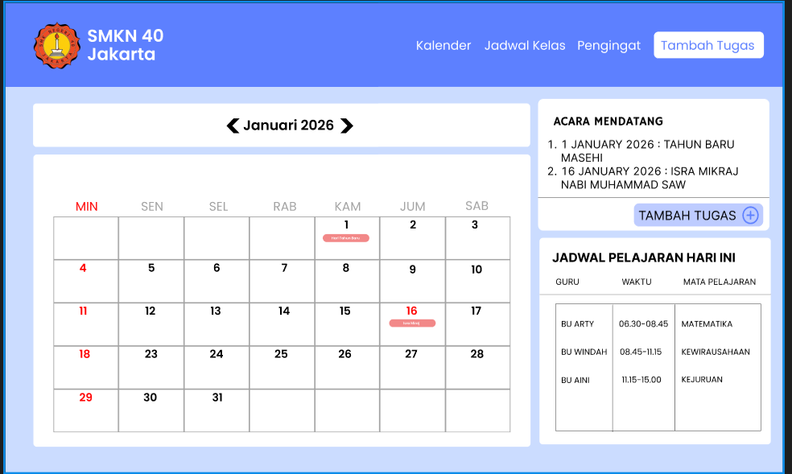

# 📅 Kalender Kelas XI RPL

[](#)
[](#)
[](#lisensi)
[](#deployment-server)

Kalender Kelas XI RPL adalah aplikasi web responsif untuk membantu siswa memantau kalender, tugas pribadi, jadwal pelajaran, acara mendatang, dan pengingat kelas dalam satu halaman. Data bersama dan data akun disimpan melalui backend sendiri, sedangkan mode tamu tetap tersimpan lokal pada browser pengguna.

🌐 **Live:** [kalender.sekeluarga.web.id](https://kalender.sekeluarga.web.id/)



## ✨ Fitur Utama

- Kalender bulanan interaktif dengan navigasi bulan.
- Penanda hari libur nasional dan cuti bersama Indonesia tahun 2026.
- Penambahan dan penghapusan tugas pribadi berdasarkan tanggal.
- Penyimpanan lokal yang terisolasi per akun dan sinkronisasi data pribadi ke server sendiri.
- Rundown harian berbasis waktu, detail aktivitas, dan checklist penyelesaian.
- Progress harian, poin, streak hari sempurna, dan animasi apresiasi saat rundown tuntas.
- Daftar acara mendatang dari API server.
- Jadwal pelajaran harian berdasarkan hari aktif.
- Pengingat umum untuk seluruh siswa.
- Autentikasi admin untuk mengelola acara, jadwal, dan pengingat.
- Antarmuka responsif untuk desktop dan perangkat mobile.

## 🛠️ Tech Stack

| Teknologi | Kegunaan |
| --- | --- |
| HTML5 | Struktur aplikasi |
| Tailwind CSS (CDN) | Styling dan desain responsif |
| JavaScript ES Modules | Logika aplikasi dan interaksi UI |
| Flask | API, autentikasi, dan session |
| SQLite | Penyimpanan data server |
| Docker Compose | Deployment backend |
| Google Fonts | Font antarmuka (`Inter`) |
| Browser Local Storage | Penyimpanan tugas pribadi dan rundown harian |

## 📋 Prasyarat

Pastikan perangkat telah memiliki:

- Browser modern, seperti Chrome, Edge, atau Firefox.
- Koneksi internet untuk memuat Tailwind CSS dan Google Fonts dari CDN.
- Docker dan Docker Compose untuk menjalankan backend.

Tidak diperlukan Node.js karena seluruh dependency frontend dimuat melalui CDN.

## 🚀 Instalasi & Setup Lokal

1. Clone repository dan masuk ke direktori proyek:

   ```bash
   git clone https://github.com/Psr354/kalender-kelas-xi-rpl.git
   cd kalender-kelas-xi-rpl
   ```

2. Siapkan konfigurasi backend:

   ```bash
   cd server
   cp .env.example .env
   ```

3. Edit `.env` lalu isi `SECRET_KEY`, `ADMIN_EMAIL`, dan `ADMIN_PASSWORD`.

4. Jalankan backend:

   ```bash
   docker compose up -d --build
   ```

5. Buka aplikasi:

   ```text
   http://localhost:5050
   ```

## Deployment Server

Aplikasi dapat ditempatkan di direktori sendiri, misalnya:

```text
~/kalender_psr354
```

Struktur deployment:

```text
kalender_psr354/
├── assets/
├── index.html
└── server/
    ├── app.py
    ├── docker-compose.yml
    ├── Dockerfile
    ├── requirements.txt
    └── .env
```

Jalankan dari server:

```bash
cd ~/kalender_psr354/server
docker compose up -d --build
```

Secara default aplikasi berjalan di port `5050`. Gunakan `nginx-kalender-psr354.conf` sebagai contoh reverse proxy Nginx.

## 💡 Cara Penggunaan

### Pengguna

1. Gunakan tombol `<` dan `>` untuk berpindah bulan.
2. Klik **Tambah Tugas** atau **+ tugas** pada tanggal tertentu.
3. Isi tanggal dan nama tugas, lalu klik **Simpan Tugas**.
4. Pilih tanggal pada bagian **Rundown satu hari penuh**.
5. Isi jam mulai, jam selesai, aktivitas, dan detailnya, lalu tambahkan ke rundown.
6. Centang aktivitas yang selesai untuk memperoleh poin dan membangun streak.
7. Lihat acara, jadwal hari ini, hari libur, dan pengingat kelas pada halaman utama.

Tanpa login, tugas, rundown, dan catatan tersimpan dalam ruang lokal tamu. Setelah login, data disimpan dalam ruang lokal khusus akun dan disinkronkan ke server. Saat akun masih kosong, data lokal tamu yang sudah ada otomatis dipindahkan ke akun agar dapat muncul di perangkat lain. Data akun berbeda tidak digabungkan satu sama lain.

### Admin

1. Pastikan `ADMIN_EMAIL` dan `ADMIN_PASSWORD` sudah diatur di `server/.env`.
2. Klik tombol login di kanan bawah halaman dan masuk menggunakan akun admin server.
3. Gunakan tombol **Edit** untuk mengelola acara, jadwal pelajaran, dan pengingat umum.

## 📁 Struktur Folder

```text
kalender-kelas-xi-rpl/
├── assets/
│   ├── jadwal_kelas.png
│   └── logo_patpul.png
├── index.html
└── README.md
```

## 🤝 Cara Berkontribusi

1. Fork repository ini.
2. Buat branch fitur baru:

   ```bash
   git checkout -b feature/nama-fitur
   ```

3. Lakukan perubahan dan pastikan aplikasi berjalan dengan baik.
4. Commit perubahan menggunakan pesan yang jelas:

   ```bash
   git commit -m "feat: tambahkan nama fitur"
   ```

5. Push branch dan buka Pull Request:

   ```bash
   git push origin feature/nama-fitur
   ```

Saat berkontribusi, pertahankan tampilan responsif, hindari memasukkan kredensial admin, dan uji perubahan pada browser desktop serta mobile.

## 📄 Lisensi

Proyek ini tersedia di bawah [MIT License](LICENSE). Tambahkan file `LICENSE` sebelum mendistribusikan proyek.

## 📬 Kontak

Untuk pertanyaan, laporan bug, atau usulan fitur, silakan:

- Mengunjungi profil GitHub [Psr354](https://github.com/Psr354).
- Membuka [GitHub Issue](https://github.com/Psr354/kalender-kelas-xi-rpl/issues).
- Mengakses aplikasi melalui [kalender-rpl.netlify.app](https://kalender-rpl.netlify.app/).
- Menghubungi maintainer melalui email: `azzamazhimmuntazhar@gmail.com`.

---

<p align="center">Dibuat untuk mendukung kegiatan belajar Kelas XI RPL SMKN 40 Jakarta.</p>
